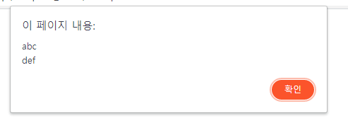
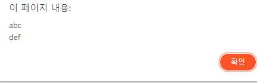

## Teamplate Literals

템플릿 리터럴은 내장된 표현식을 허용하는 문자열 리터럴이다. 백틱 ( ` )을 이용한다. 일반 문자열을 출력할 떄 사용하는 따옴표 ( " )와 유사한데, 편리하게 사용할 수 있다는 장점이 있다. 직접 확인해보자.

### Syntax

    let str_a = "abc\ndef";
    let str_b = `abc
    def`;

    alert(str_a);
    alert(str_b);

    `string text ${expression} string text`

    tag `string text ${expression} string text`

### 표현식 삽입법

1의 경우

    var a = 5;
    var b = 10;
    console.log("Fifteen is " + (a + b) + " and\nnot " + (2 * a + b) + ".");
    // "Fifteen is 15 and
    // not 20."

2의 경우

    var a = 5;
    var b = 10;
    console.log(`Fifteen is ${a + b} and
    not ${2 * a + b}.`);
    // "Fifteen is 15 and
    // not 20."

위와 같이 매우 간결하게 사용할 수 있다.

표현식을 사용하려면 "${}로 감싸주면 된다.