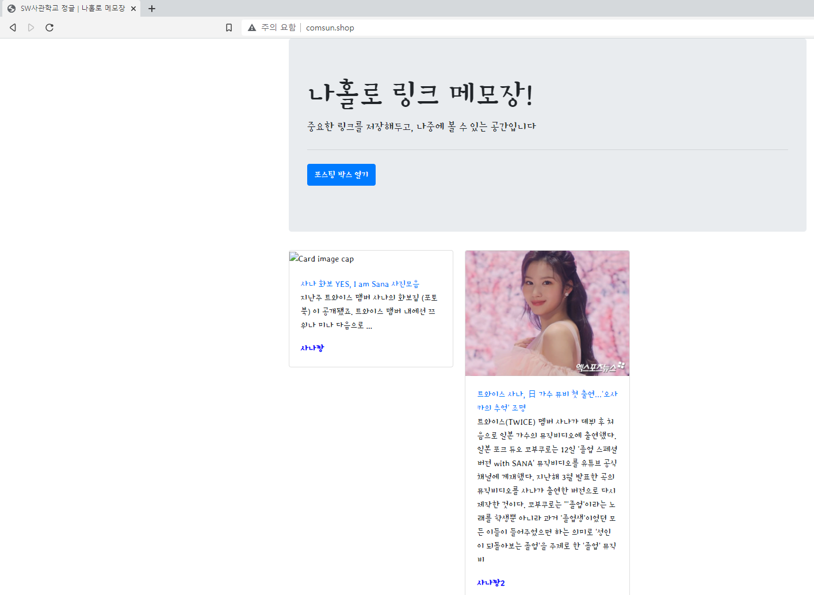

# Back-End

## [JAVA](https://github.com/Com-Sun/study-java)

- [자바 로드맵](./Back-End/studyJava/javaRoadmap.md)

- [Tools - Build & IDE](./Back-End/studyJava/build_IDE.md)

### [JCF](https://github.com/Com-Sun/ThinkDataStructures)

### JAVA8

 

## Web Basic

* [IntelliJ를 사용한 웹개발 기초](https://github.com/Com-Sun/study-intellij)

### [Eclipse를 사용한 실전 JSP](https://github.com/Com-Sun/study-jsp)

 

# Front-End

### [JavaScript](/Front-End/study-javascript/README.md)
### [jQuery](https://github.com/Com-Sun/study-jQuery)

 

# [Problem Solving](https://github.com/Com-Sun/problem-solving)

- [입출력](./problemSolving/입출력.md)

 

### [Shell script](./linux)

 

## Mini Project

### [Python Mini Project]()
- Python
- mongoDB
- Flask
- AWS
- HTML5, CSS3
- Javascript
    - jQuery
    - ajax

완성본

배운것을 저장소에 새로 정리해서 올릴 예정