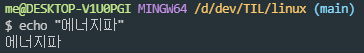
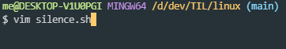
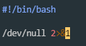
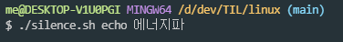
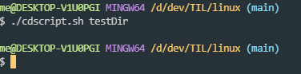
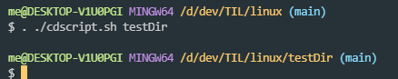

이곳은 리눅스의 개념을 정리하기 위해 만든 **임시** 저장소입니다.

- 리다이렉션은 command > filename와 같은 형태로 사용되고, 파일을 읽어서 표준 입력으로 전달하거나, 표준출력을 파일로 저장한다. 파일 대신 명령의 결과를 입력, 출력할 수도 있습니다. &를 붙이면 표준 에러도 함께 전달한다.

- 2>&1: 표준 에러를 표준 출력으로 리다이렉션 하는 것. 리눅스는 표준 입력과 표준 출력을 숫자로 표현할 수도 있다. 이를 파일 디스크립터라고 한다.
- 0: 표준 입력, 1: 표준 출력, 2: 표준 에러

- 파일 디스크립터: 파일 디스크립터(File Descriptor)란 리눅스 혹은 유닉스 계열의 시스템에서 프로세스(process)가 파일(file)을 다룰 때 사용하는 개념으로, 프로세스에서 특정 파일에 접근할 때 사용하는 추상적인 값이다.

[개념 참고](https://www.baeldung.com/linux/silencing-bash-output)

#### /dev/null

/dev/null은 표준 출력을 버리기 위한 용도로 사용되는  디스크립터이다. 직접 실습해보자.

터미널에서 에너지파를 사용했다.

vim을 이용해 에너지파를 막는 쉘 스크립트를 만들어보자.

/dev/null 2>&1을 썼다. 표준 에러를 표준 출력으로 리다이렉션하라는 의미이다. 그런데 앞에 /dev/null이 있다. 이는 표춘출력을 버리기 위해 사용한다. 즐, 표준 에러와 표준 출력을 둘다 버린다는 의미이다.

silence를 사용한 뒤 에너지파를 쓴 결과, 에너지파가 나오지 않았다.

#### 명령어

- &&: 성공한다면 다음 명령어 실행

#### 폴더 바꾸기

쉘 스크립트를 이용하여 폴더를 바꿔보자. 
**cdscript.sh**

    #!/bin/sh
    cd "$1"

이제 디렉토리를 만들자. 

    $ mkdir testDir

위에서 만든 스크립트를 실행해보자.

cd명령어가 실행되지 않는다. 이유가 무엇일까?

스크립트는 subshell에서 동작한다. 즉, parent shell이 실행되는 directory를 바꾸지 못한다.

해결방법: source command 사용 or '.' 사용

