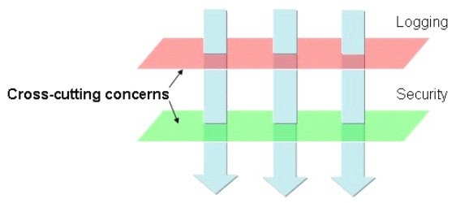

### 04-16 회고

이번주에 처음 스프링을 배웠다. 모든것이 처음이다보니 모르는 개념이 너무 많았다. 매일 올라오는 과제를 이해하기 위해 정말 많은 시간을 투자했다.

스프링을 이해하기 위해 인프런 김영한님의 스프링 코어강의를 구매했다. 교수님께서 올려주신 강의자료를 복습했다.

평가과제를 하며 내게 부족했던 개념들을 빠르게 습득한 것 같다. 간단하게 복습하며 오늘 회고를 마무리하자.

### Spring AOP

core concerns: 주요 관심사이다. Service와 같은 클래스라고 생각하자.

cross-cutting concerns : 횡단 관심사이다. 뭔 말이냐? service는 종류가 여러가지다. 그런데 종류는 달라도 같은 기능을 하는 부분이 존재한다. 이런 부분을 모아놓은 것이다.

즉, 클래스를 90도 방향으로 자른것이라 생각하자.

### AOP Logging시 생기는 순환참조 문제

ComponentScan을 사용하면 딱히 문제는 없다.

직접 Bean을 등록할 경우 + Around advice + 모든 public method를 포인트컷으로 등록 할 경우 순환참조 문제가 생긴다.

Mainconfiguration을 타겟에서 지워주면 해결할 수 있다.

